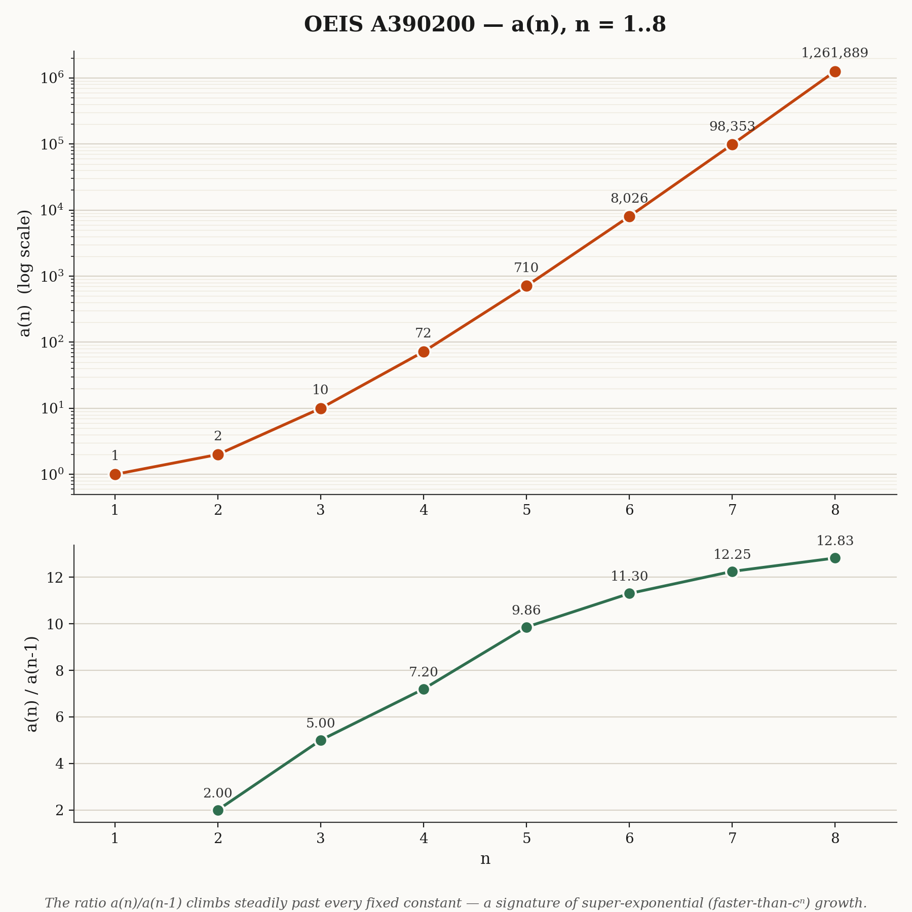

# Hyperbolic Polyplet Enumerator

**Status:** The exact algebraic extension computed by this repository was officially approved and added to [OEIS A390200](https://oeis.org/A390200) on June 3, 2026.

**Goal:** Extend OEIS A390200, the number of free $n$-celled polyplets in the $\\{4,5\\}$ tessellation of the hyperbolic plane. Polyplets are connected by edge or vertex adjacency; each square has 4 edge-neighbors and 8 vertex-neighbors.

**Sequence Data (A390200):**  

n:    1, 2, 3, 4, 5, 6, 7, 8  
a(n): 1, 2, 10, 72, 710, 8026, 98353, 1261889

<p align="center">


## File Structure

* **`Polyplets_Exact.py`** - The primary direct canonical expansion enumerator. Generates polyplets dynamically and canonicalizes their coordinate states against the face stabilizer.
* **`Redelmeier-and-Burnside's-Lemma-Verifier.py`** - A second enumerator. It generates rooted shapes with Redelmeier's method and computes the free count with the orbit-counting formula.
* **`A119611-Verifier.py`** - A variant of the pipeline configured for strict edge-only connectivity to verify the algebraic core against an established sequence.
* **`Coxeter-Verifier.py`** - A symbolic verification script using SymPy to test that the base matrix generators strictly satisfy the $[4,5]$ Coxeter group relations.
* **`Output.json`** - Structured output data containing candidate counts, computational statistics, execution runtimes, and the verified extension data.

## Implementation & Methodology

The exact backend models cells as cosets of the face stabilizer in the Coxeter group $[4,5]$, using matrices over the algebraic number field $\mathbb{Q}(\sqrt{2}, \sqrt{5})$. Coefficients are stored exactly as integer numerators over powers of two to completely eliminate floating-point artifacts. 

The local model rigorously checks:
* The square stabilizer has order 8 ($D_4$).
* The vertex stabilizer has order 10 ($D_5$).
* The polyplet neighbor set has size 12.

To guarantee correctness, the repository uses two mathematically distinct enumeration philosophies that corroborate each other:

1. **Direct Canonicalization (`Polyplets_Exact.py`):** Expands the boundary dynamically and canonicalizes each finite connected set by translating every cell to the base cell and minimizing over the square stabilizer. 
2. **Fixed Spanning Tree & Orbit-Stabilizer (`Redelmeier-and-Burnside's-Lemma-Verifier.py`):** Uses Redelmeier's method to generate every fixed polyplet that contains the base cell. Each shape is scored as soon as it is generated and is not stored, so memory use stays small. The free count comes from the orbit-counting formula $a(n) = \frac{1}{8n}\sum_A |\mathrm{Stab}(A)|$, where the sum runs over the rooted shapes $A$. The group $[4,5]$ is infinite, so this is not the classical Burnside lemma. The formula holds because the face stabilizer is finite.

## Verification

To prove the algebraic engine, the neighbor generation logic was restricted to edge-only adjacency ($s_2$ reflections) and successfully reproduced the known prefix of **OEIS A119611** (Strict $\\{4,5\\}$ Polyominoes) perfectly up to $n=12$. The continuous geometric space is further verified symbolically via `Coxeter-Verifier.py`.

### Independent check

The folder `independent-check/` holds a C++ program, `enum45.cpp`, that recomputes the sequence without using any code or arithmetic from the Python scripts. It builds the tiling from hyperbolic isometries in the hyperboloid model and uses a different canonical form. It counts in two separate ways, and the file `output_polyplets_n8.txt` shows the full run.

| $n$ | Free shapes (level by level) | Rooted shapes with minimal root | $\sum \|\mathrm{Stab}\| / 8n$ | Rooted shapes $\|R_n\|$ |
| :--- | :--- | :--- | :--- | :--- |
| 6 | 8026 | 8026 | 8026 | 380148 |
| 7 | 98353 | 98353 | 98353 | 5486292 |
| 8 | 1261889 | 1261889 | 1261889 | 80680136 |

The numerical checks passed with a worst identification error of about $2 \times 10^{-6}$, while distinct cells differ by at least $0.618$. The same program with edge-only adjacency reproduces A119611 up to $n = 12$. The full $n = 8$ run takes about five minutes on an Apple M4.

```bash
clang++ -O3 -std=c++17 -o enum45 independent-check/enum45.cpp
./enum45 plet both 8 8
./enum45 omino redel 12 8
```

## Status & Approved Extension

Both the direct canonicalizer and the Burnside enumerator reproduce the full known prefix and mathematically converge on the extended term for $n=8$. This result has been officially approved and published by the OEIS.

| $n$ | Count | Status | Candidates | Seconds |
| :--- | :--- | :--- | :--- | :--- |
| 1 | 1 | ok | 1 | 0.000 |
| 2 | 2 | ok | 12 | 0.009 |
| 3 | 10 | ok | 35 | 0.029 |
| 4 | 72 | ok | 238 | 0.253 |
| 5 | 710 | ok | 2150 | 1.951 |
| 6 | 8026 | ok | 25540 | 24.498 |
| 7 | 98353 | ok | 337234 | 347.390 |
| **8** | **1261889** | **new** | **4725668** | **6753.712** |

**Extended Term:**  
$$a(8) = 1261889$$

## References
* [OEIS A390200](https://oeis.org/A390200)
* [OEIS A119611](https://oeis.org/A119611)
* [arXiv:2109.05331](https://arxiv.org/abs/2109.05331), Extremal $\{p,q\}$-Animals
* [arXiv:2206.14910](https://arxiv.org/abs/2206.14910), Isoperimetric Formulas for Hyperbolic Animals
